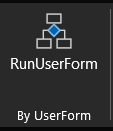
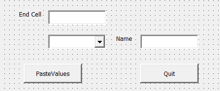

# CopyAndPasting the Values of Range

**Steps to Understand the Functionality of the Project:**

 - Open the Excel file named "CopyAndPasteAsValue," which has Micro-enabled features.
 - Navigate to the "Home" tab.
 - Click on the "UserForm" button located in the UserForm section, as shown in the attached screenshot.
 - This will open the User Form, as illustrated in the attached image.
 - Enter the required information into the form.
 - The tool will then copy the specified data range and paste it into either a new sheet or a new workbook, depending on the selected option.

